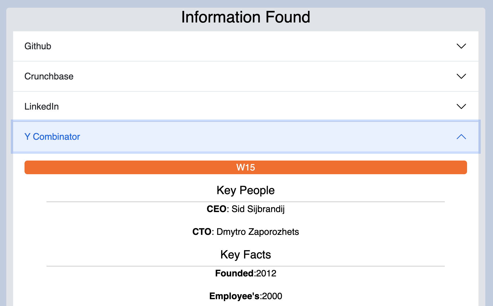
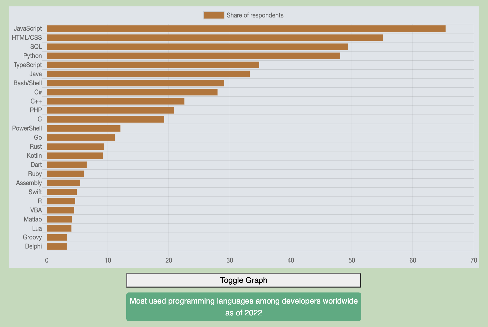
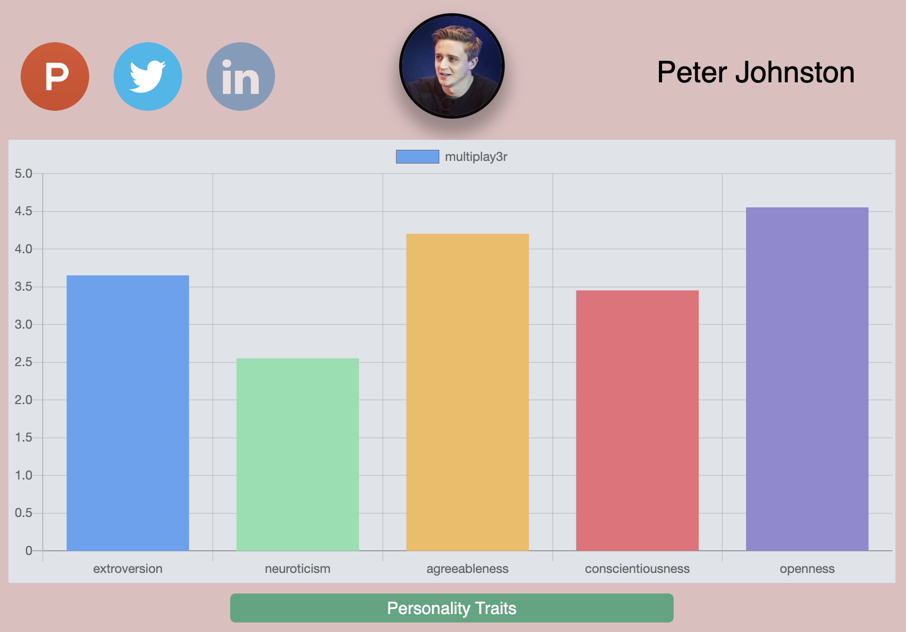
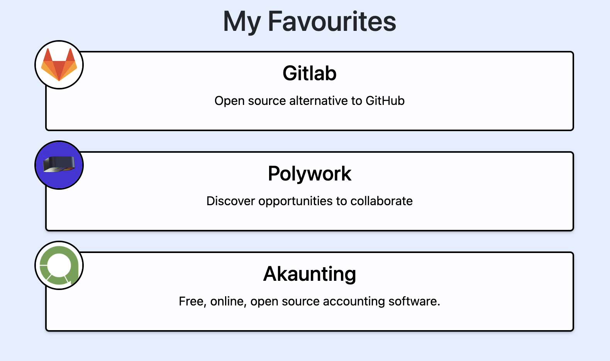
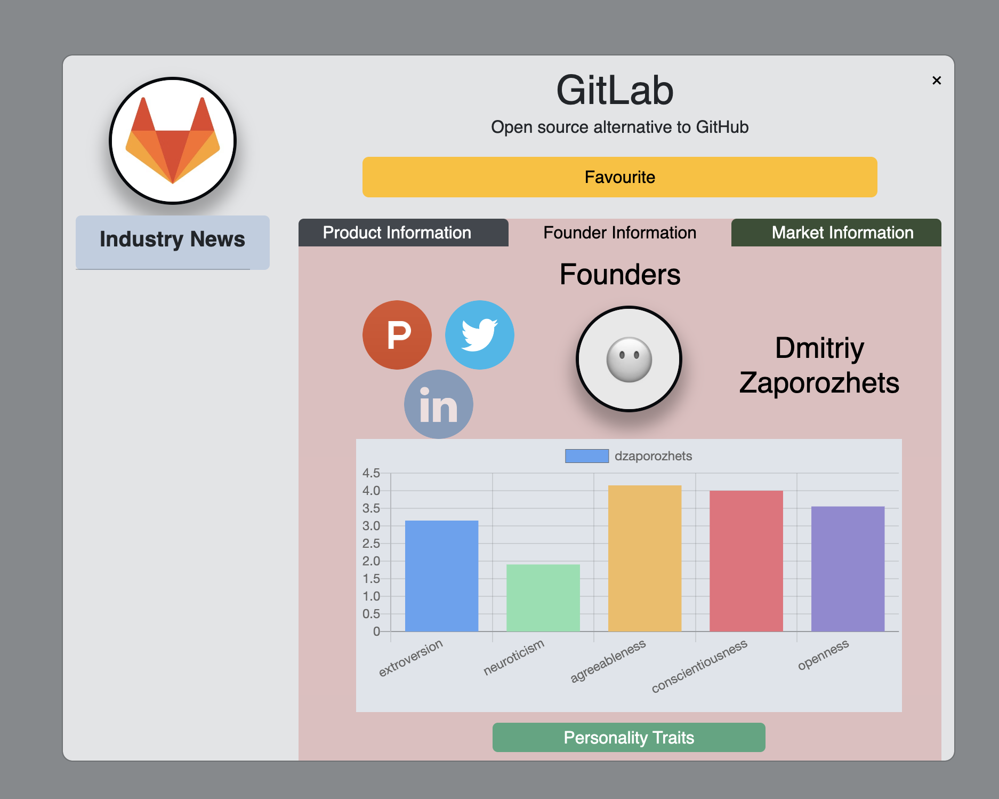
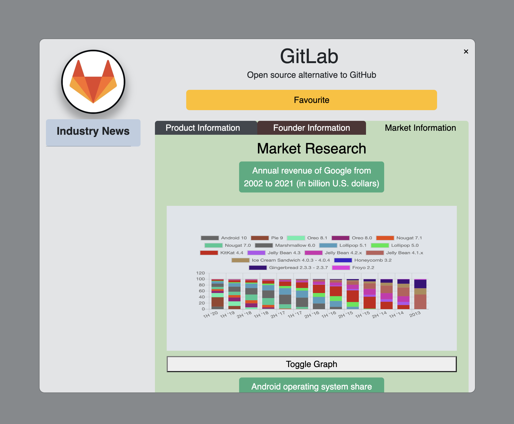
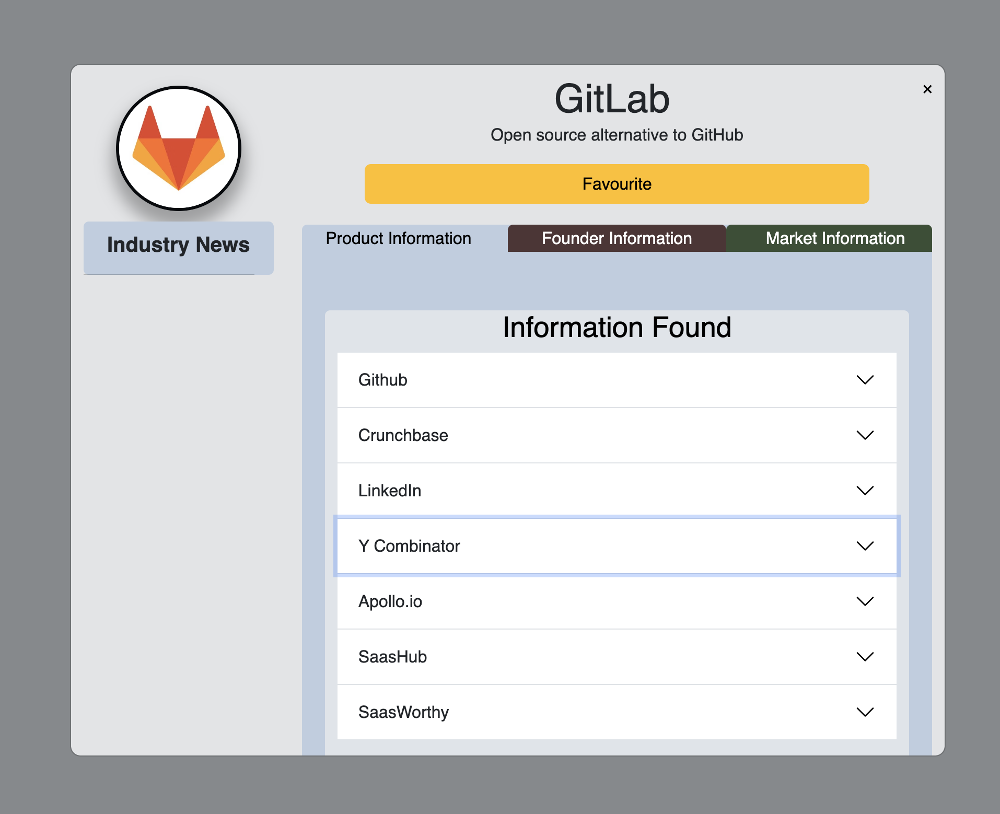

<h1>VCCF</h1>

VCCF (<em>Venture Capital Company Finder</em>) is a Python based web appication that allows Venture Capital Firms to reseaerch Start Up companies from <a href="https://www.producthunt.com/">producthunt.com</a> by collecting data from the web, scraping website, and presenting the dataa in the form of charts, tables and statistics.

<h1>Installation</h1>

Due to the delicate nature of webscraping much of the core functionaity of this web applciation is no longer viable, due to lack of maintenance of the website and many of the websites being scraped employing anti-scraping barriers to their codeset. Therefor installation of this Web App is no longer realistic and the code is now theoretical / proof of concept

<h1>Features</h1>

